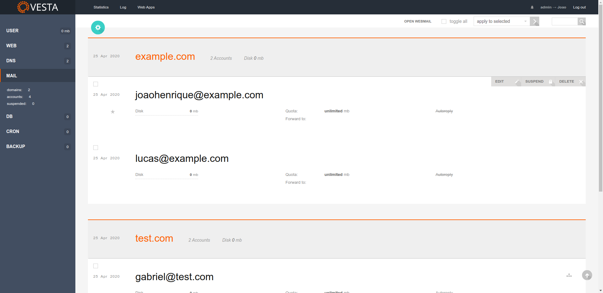

## VestaCP Mail List

Change the vesta mail list to a single list of web domains and accounts.

## Installation

* Install [Vesta Plugins](https://github.com/jhmaverick/vestacp-plugin-manager) if not already installed.
* In the Vesta panel access "Plugins" menu and add the plugin by url `https://github.com/jhmaverick/single-mail-list`.

